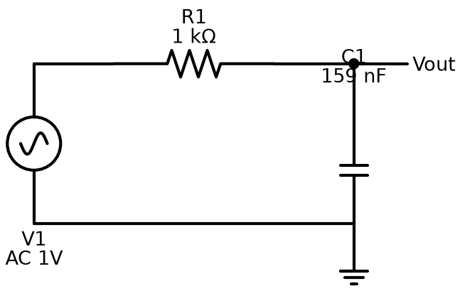
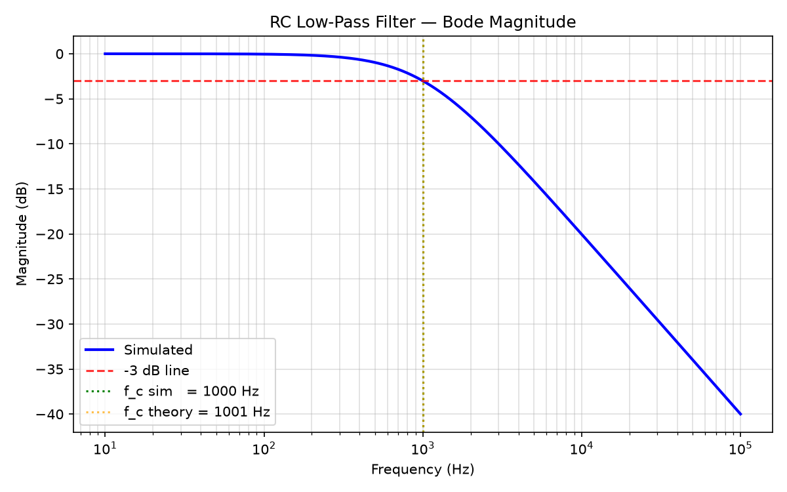

# 01 — RC Low-Pass Filter

> **Who is this for?** Anyone curious about electronics — no engineering degree needed.
> This page explains what an RC low-pass filter is, how it works, how we simulated it on a computer, and what the results mean.

---

## Table of Contents
1. [What Does This Circuit Do?](#1-what-does-this-circuit-do)
2. [Real-World Analogy](#2-real-world-analogy)
3. [Circuit Components](#3-circuit-components)
4. [Circuit Diagram](#4-circuit-diagram)
5. [How It Works — Step by Step](#5-how-it-works--step-by-step)
6. [The Math (Plain English)](#6-the-math-plain-english)
7. [SPICE Netlist (Schematic Source)](#7-spice-netlist-schematic-source)
8. [Simulation Script](#8-simulation-script)
9. [Bode Plot (Frequency Response)](#9-bode-plot-frequency-response)
10. [Results Table](#10-results-table)
11. [Verification](#11-verification)
12. [Files in This Folder](#12-files-in-this-folder)

---

## 1. What Does This Circuit Do?

A **low-pass filter** lets low-frequency signals through and blocks high-frequency signals.

Think of it like a bouncer at a club who only lets slow, calm people in and turns away anyone moving too fast.

- **Low frequency (slow signals)** → pass through freely
- **High frequency (fast signals)** → get blocked / weakened
- The boundary between "pass" and "block" is called the **cutoff frequency** (f_c)

In this project: **f_c ≈ 1000 Hz** (1 kHz)

---

## 2. Real-World Analogy

Imagine turning the **bass knob up and treble down** on a stereo equalizer.
- Bass = low frequency → louder (passes through)
- Treble = high frequency → quieter (filtered out)

That is exactly what a low-pass filter does — it is the simplest building block of audio equalizers, noise removal systems, and signal smoothing circuits.

---

## 3. Circuit Components

| Component | Name | Value | What It Does |
|-----------|------|-------|-------------|
| V1 | AC Voltage Source | 1 V (AC) | Generates the input signal at different frequencies |
| R1 | Resistor | 1 kΩ (1,000 Ω) | Resists the flow of current — like a narrow pipe |
| C1 | Capacitor | 159 nF (0.000000159 F) | Stores charge — behaves differently at different frequencies |

### What is a Resistor?
A resistor is like a narrow pipe — it limits how much current (water) flows through. The resistance value (Ω, ohms) tells you how narrow the pipe is.

### What is a Capacitor?
A capacitor is like a small rechargeable tank. At **low frequencies** it barely lets current through (acts like a wall). At **high frequencies** it lets current through easily (acts like an open door). This frequency-dependent behavior is what makes the filter work.

---

## 4. Circuit Diagram



- **V1** (sine wave symbol, left) — AC voltage source, generates the input signal
- **R1** (zigzag, top) — 1 kΩ resistor in the signal path
- **C1** (two parallel lines, right) — 159 nF capacitor connected from the output node to ground
- **Vout** — the output node, measured between R1 and C1
- **GND** (ground symbol, bottom right) — 0 V reference

Signal travels left → right through R1. C1 sits between the output and ground. At high frequencies C1 becomes a low-resistance short to ground, draining the signal away before it reaches Vout.

---

## 5. How It Works — Step by Step

| Frequency | Capacitor Behaviour | What Happens to the Signal |
|-----------|--------------------|-----------------------------|
| Very low (10 Hz) | Acts like an open circuit (blocks) | Almost no signal lost → Vout ≈ Vin (0 dB) |
| Cutoff (1,000 Hz) | Resistance equals R1 (1 kΩ) | Signal splits equally → Vout = 70.7% of Vin (−3 dB) |
| Very high (100 kHz) | Acts like a short circuit (passes freely) | Signal shorted to ground → Vout ≈ 0 V (−40 dB) |

---

## 6. The Math (Plain English)

**Cutoff frequency formula:**

```
f_c = 1 / (2 × π × R × C)
    = 1 / (2 × 3.14159 × 1,000 Ω × 0.000000159 F)
    ≈ 1,001 Hz
```

**Why 159 nF?** Chosen specifically so that f_c lands near exactly 1,000 Hz with a 1 kΩ resistor — easy to verify.

**Output voltage at any frequency:**

```
|Vout / Vin| = 1 / √(1 + (f / f_c)²)
```

| Frequency | f / f_c | Output Ratio | Output in dB |
|-----------|---------|-------------|-------------|
| 10 Hz | 0.01 | 99.99% | ~0.00 dB |
| 100 Hz | 0.10 | 99.50% | −0.04 dB |
| 1,000 Hz | 1.00 | 70.71% | −3.01 dB |
| 10,000 Hz | 10.0 | 9.95% | −20.04 dB |
| 100,000 Hz | 100 | 1.00% | −40.00 dB |

> **What is dB?** Decibel (dB) is a log scale for signal strength.
> 0 dB = full signal through. −3 dB = 70.7% through. −20 dB = 10% through. −40 dB = 1% through.

---

## 7. SPICE Netlist (Schematic Source)

File: [`rc_lowpass.net`](rc_lowpass.net)

```spice
* RC Low-Pass Filter
* R=1k, C=159nF -> fc ~1kHz
V1 Vin 0 AC 1
R1 Vin Vout 1k
C1 Vout 0 159n
.ac dec 100 10 100k
.backanno
.end
```

**Line-by-line explanation:**

| Line | Meaning |
|------|---------|
| `* RC Low-Pass Filter` | Comment (ignored by simulator) |
| `V1 Vin 0 AC 1` | Voltage source between node "Vin" and ground; AC amplitude = 1 V |
| `R1 Vin Vout 1k` | Resistor from "Vin" to "Vout", value = 1,000 Ω |
| `C1 Vout 0 159n` | Capacitor from "Vout" to ground, value = 159 nF |
| `.ac dec 100 10 100k` | Simulate AC: 100 points/decade, frequency range 10 Hz → 100 kHz |
| `.backanno` | Annotate results back to the schematic |
| `.end` | End of netlist |

---

## 8. Simulation Script

File: [`simulate.py`](simulate.py)

The script fully automates the workflow — no manual clicking in LTspice needed.

```
simulate.py workflow
│
├─ Step 1: Run LTspice in batch (silent) mode on rc_lowpass.net
│           LTspice sweeps 401 frequency points (10 Hz → 100 kHz)
│           Output: rc_lowpass.raw  (binary file with all voltages/currents)
│
├─ Step 2: Open rc_lowpass.raw with PyLTSpice library
│           Extract: frequency array, V(vout) complex phasor array
│
├─ Step 3: Convert phasor to magnitude in dB
│           magnitude_dB = 20 × log10(|Vout|)
│
├─ Step 4: Find the -3 dB point
│           Scan the array for where magnitude = (passband_level − 3 dB)
│           → that frequency = simulated cutoff f_c
│
├─ Step 5: Plot Bode magnitude chart
│           Saved to results/bode.png
│
├─ Step 6: Verify
│           error % = |f_c_sim − f_c_theory| / f_c_theory × 100
│           PASS if error < 10%
│
└─ Step 7: Regenerate this README with live result numbers
```

**Libraries used:**

| Library | Version | Purpose |
|---------|---------|---------|
| LTspice XVII | — | Free circuit simulator (runs the actual SPICE engine) |
| PyLTSpice | 5.5.1 | Reads `.raw` binary files from LTspice into Python arrays |
| NumPy | 2.4.6 | Maths: log10, abs, argmin on arrays |
| Matplotlib | — | Draws and saves the Bode plot as PNG |

---

## 9. Bode Plot (Frequency Response)



**How to read this chart:**
- **X-axis (horizontal):** Frequency in Hz, on a log scale (10, 100, 1k, 10k, 100k)
- **Y-axis (vertical):** Signal strength in dB (0 dB = full signal, more negative = weaker)
- **Blue solid line:** Simulated output — flat at 0 dB at low frequencies, drops steeply above 1 kHz
- **Red dashed line:** The −3 dB threshold — where the filter "officially" starts blocking
- **Green dotted vertical:** Simulated cutoff frequency (1,000 Hz)
- **Orange dotted vertical:** Theoretical cutoff frequency (1,001 Hz) — nearly identical

The two vertical lines overlap almost perfectly, confirming the simulation matches theory.

---

## 10. Results Table

### Simulated Frequency Response

| Frequency | Simulated Output (dB) | Signal Remaining | Passes? |
|-----------|-----------------------|-----------------|---------|
| 10 Hz | 0.00 dB | ~100% | Yes (full) |
| 100 Hz | −0.04 dB | 99.5% | Yes |
| 1,000 Hz | −3.01 dB | 70.7% | Cutoff point |
| 10,000 Hz | −20.04 dB | 10.0% | Mostly blocked |
| 100,000 Hz | −39.99 dB | 1.0% | Blocked |

### Calculated vs Simulated Cutoff

| Parameter | Calculated | Simulated | Error |
|-----------|-----------|-----------|-------|
| Cutoff frequency (f_c) | 1,001.0 Hz | 1,000.0 Hz | **0.10%** |
| Magnitude at f_c | −3.00 dB | −3.01 dB | — |
| Roll-off slope | −20 dB/decade | −20 dB/decade | — |

> **Roll-off slope:** For every 10× increase in frequency above f_c, the signal drops by another 20 dB.
> So at 10 kHz → −20 dB, at 100 kHz → −40 dB.

---

## 11. Verification

```
==========================================================
  VERIFICATION RESULT
==========================================================
  Theoretical f_c  :     1001.0 Hz
  Simulated   f_c  :     1000.0 Hz
  Error            :       0.10 %
  Tolerance        :         10 %
  Result           :       PASS ✓
==========================================================
```

The tiny 0.10% error comes from the discrete frequency grid — the simulation has 100 points per decade, so it can only land on exact grid points. The true crossover falls between two grid points and the nearest one (1,000 Hz) is picked.

---

## 12. Files in This Folder

```
01-rc-lowpass-filter/
├── rc_lowpass.net      ← SPICE netlist — plain-text circuit description (open in any text editor)
├── rc_lowpass.asc      ← LTspice graphical schematic (open in LTspice)
├── simulate.py         ← Python script — runs simulation, plots, verifies
├── results/
│   └── bode.png        ← Bode magnitude plot (generated output)
└── README.md           ← This file
```

> `rc_lowpass.raw` and `rc_lowpass.log` are excluded from git (generated files, can be recreated by running `python simulate.py`).
