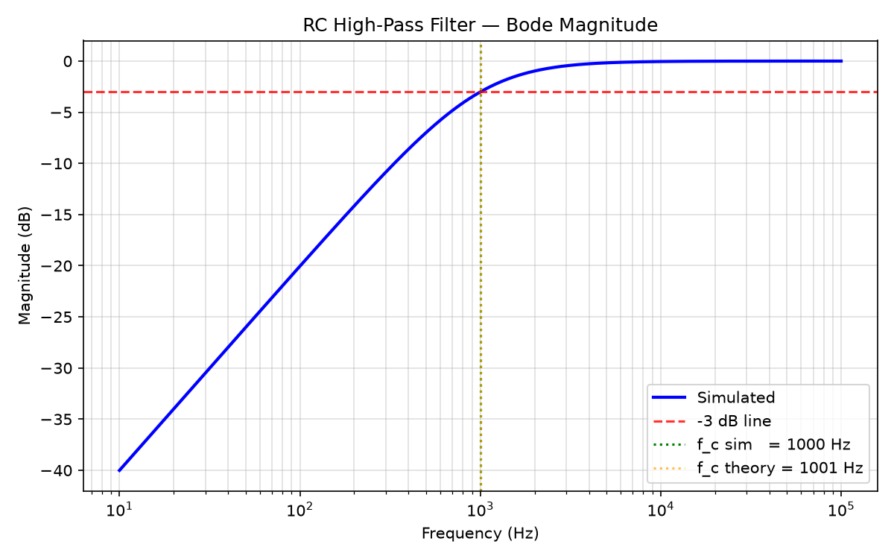

# 02 — RC High-Pass Filter

> **Who is this for?** Anyone curious about electronics — no engineering degree needed.
> This page explains what an RC high-pass filter is, how it works, how we simulated it on a computer, and what the results mean.

---

## Table of Contents
1. [What Does This Circuit Do?](#1-what-does-this-circuit-do)
2. [Real-World Analogy](#2-real-world-analogy)
3. [Circuit Components](#3-circuit-components)
4. [Circuit Diagram](#4-circuit-diagram)
5. [How It Works — Step by Step](#5-how-it-works--step-by-step)
6. [The Math (Plain English)](#6-the-math-plain-english)
7. [SPICE Netlist (Schematic Source)](#7-spice-netlist-schematic-source)
8. [Simulation Script](#8-simulation-script)
9. [Bode Plot (Frequency Response)](#9-bode-plot-frequency-response)
10. [Results Table](#10-results-table)
11. [Verification](#11-verification)
12. [Comparison with Low-Pass Filter](#12-comparison-with-low-pass-filter)
13. [Files in This Folder](#13-files-in-this-folder)

---

## 1. What Does This Circuit Do?

A **high-pass filter** does the opposite of a low-pass filter — it lets high-frequency signals through and blocks low-frequency signals.

Think of it like a bouncer who only lets fast, energetic people in and turns away anyone moving too slowly.

- **High frequency (fast signals)** → pass through freely
- **Low frequency (slow signals)** → get blocked / weakened
- The boundary between "pass" and "block" is the **cutoff frequency** (f_c)

In this project: **f_c ≈ 1000 Hz** (1 kHz)

---

## 2. Real-World Analogy

Imagine turning the **treble knob up and bass down** on a stereo equalizer.
- Treble = high frequency → louder (passes through)
- Bass = low frequency → quieter (filtered out)

High-pass filters are used in:
- Microphone circuits to cut low-frequency hum and rumble
- Tweeters (small speakers) — only receive high frequencies
- Removing DC offset from audio signals
- Differentiator circuits in control systems

---

## 3. Circuit Components

| Component | Name | Value | What It Does |
|-----------|------|-------|-------------|
| V1 | AC Voltage Source | 1 V (AC) | Generates the input signal at different frequencies |
| C1 | Capacitor | 159 nF (0.000000159 F) | In series — blocks low frequencies, passes high frequencies |
| R1 | Resistor | 1 kΩ (1,000 Ω) | To ground — carries the current that passes through C1 |

### Key insight — component positions are swapped vs low-pass:
- **Low-pass:** R in series, C to ground → C shorts high frequencies to ground
- **High-pass:** C in series, R to ground → C blocks low frequencies from reaching Vout

---

## 4. Circuit Diagram

```
      C1 = 159 nF
Vin ───┤├──────────┬──── Vout
                   │
               [/\/\/\] R1 = 1 kΩ
                   │
                  GND (0 V)
```

- **Vin** — input signal from the voltage source
- **C1** — series capacitor in the signal path (the key filtering element)
- **Vout** — output signal we measure (between C1 and R1)
- **R1** — resistor from Vout to ground
- **GND** — ground (0 V reference)

Signal must pass through C1 to reach Vout. At low frequencies C1 blocks the path. At high frequencies C1 is transparent and the signal appears at Vout across R1.

---

## 5. How It Works — Step by Step

| Frequency | Capacitor Behaviour | What Happens to the Signal |
|-----------|--------------------|-----------------------------|
| Very low (10 Hz) | Acts like an open circuit (blocks) | Signal can't get through C1 → Vout ≈ 0 V (−40 dB) |
| Cutoff (1,000 Hz) | Resistance equals R1 (1 kΩ) | Signal splits equally → Vout = 70.7% of Vin (−3 dB) |
| Very high (100 kHz) | Acts like a short circuit (transparent) | Signal passes freely → Vout ≈ Vin (0 dB) |

---

## 6. The Math (Plain English)

**Cutoff frequency formula** (same formula as low-pass — only the topology changes):

```
f_c = 1 / (2 × π × R × C)
    = 1 / (2 × 3.14159 × 1,000 Ω × 0.000000159 F)
    ≈ 1,001 Hz
```

**Output voltage at any frequency:**

```
|Vout / Vin| = (f / f_c) / √(1 + (f / f_c)²)
```

| Frequency | f / f_c | Output Ratio | Output in dB |
|-----------|---------|-------------|-------------|
| 10 Hz | 0.01 | 1.00% | −40.00 dB |
| 100 Hz | 0.10 | 9.95% | −20.04 dB |
| 1,000 Hz | 1.00 | 70.71% | −3.01 dB |
| 10,000 Hz | 10.0 | 99.50% | −0.04 dB |
| 100,000 Hz | 100 | 99.99% | ~0.00 dB |

> **What is dB?** Decibel (dB) is a log scale for signal strength.
> 0 dB = full signal. −3 dB = 70.7%. −20 dB = 10%. −40 dB = 1%.

---

## 7. SPICE Netlist (Schematic Source)

File: [`rc_highpass.net`](rc_highpass.net)

```spice
* RC High-Pass Filter
* R=1k, C=159nF -> fc ~1kHz
V1 Vin 0 AC 1
C1 Vin Vout 159n
R1 Vout 0 1k
.ac dec 100 10 100k
.backanno
.end
```

**Line-by-line explanation:**

| Line | Meaning |
|------|---------|
| `* RC High-Pass Filter` | Comment (ignored by simulator) |
| `V1 Vin 0 AC 1` | Voltage source between node "Vin" and ground; AC amplitude = 1 V |
| `C1 Vin Vout 159n` | Capacitor from "Vin" to "Vout" (series, in the signal path), value = 159 nF |
| `R1 Vout 0 1k` | Resistor from "Vout" to ground, value = 1,000 Ω |
| `.ac dec 100 10 100k` | Simulate AC: 100 points/decade, frequency range 10 Hz → 100 kHz |
| `.backanno` | Annotate results back to the schematic |
| `.end` | End of netlist |

> **Spot the difference from low-pass:** C1 and R1 positions are swapped — C1 is now in series, R1 is to ground.

---

## 8. Simulation Script

File: [`simulate.py`](simulate.py)

The script fully automates the workflow — no manual clicking in LTspice needed.

```
simulate.py workflow
│
├─ Step 1: Run LTspice in batch (silent) mode on rc_highpass.net
│           LTspice sweeps 401 frequency points (10 Hz → 100 kHz)
│           Output: rc_highpass.raw  (binary file with all voltages/currents)
│
├─ Step 2: Open rc_highpass.raw with PyLTSpice library
│           Extract: frequency array, V(vout) complex phasor array
│
├─ Step 3: Convert phasor to magnitude in dB
│           magnitude_dB = 20 × log10(|Vout|)
│
├─ Step 4: Find the -3 dB point
│           Reference = high-frequency passband (last point, near 0 dB)
│           Scan array for where magnitude = (passband_level − 3 dB)
│           → that frequency = simulated cutoff f_c
│
├─ Step 5: Plot Bode magnitude chart
│           Saved to results/bode.png
│
├─ Step 6: Verify
│           error % = |f_c_sim − f_c_theory| / f_c_theory × 100
│           PASS if error < 10%
│
└─ Step 7: Regenerate this README with live result numbers
```

**Libraries used:**

| Library | Version | Purpose |
|---------|---------|---------|
| LTspice XVII | — | Free circuit simulator (runs the actual SPICE engine) |
| PyLTSpice | 5.5.1 | Reads `.raw` binary files from LTspice into Python arrays |
| NumPy | 2.4.6 | Maths: log10, abs, argmin on arrays |
| Matplotlib | — | Draws and saves the Bode plot as PNG |

---

## 9. Bode Plot (Frequency Response)



**How to read this chart:**
- **X-axis (horizontal):** Frequency in Hz, log scale (10 → 100 kHz)
- **Y-axis (vertical):** Signal strength in dB (0 dB = full signal, more negative = weaker)
- **Blue solid line:** Simulated output — drops steeply at low frequencies, flat at 0 dB above 1 kHz
- **Red dashed line:** The −3 dB threshold (cutoff point)
- **Green dotted vertical:** Simulated cutoff frequency (1,000 Hz)
- **Orange dotted vertical:** Theoretical cutoff frequency (1,001 Hz) — nearly identical

Notice this plot is a **mirror image** of the low-pass filter plot — the roles of low and high frequencies are flipped.

---

## 10. Results Table

### Simulated Frequency Response

| Frequency | Simulated Output (dB) | Signal Remaining | Passes? |
|-----------|-----------------------|-----------------|---------|
| 10 Hz | −40.00 dB | 1.0% | Blocked |
| 100 Hz | −20.04 dB | 10.0% | Mostly blocked |
| 1,000 Hz | −3.01 dB | 70.7% | Cutoff point |
| 10,000 Hz | −0.04 dB | 99.5% | Yes |
| 100,000 Hz | ~0.00 dB | ~100% | Yes (full) |

### Calculated vs Simulated Cutoff

| Parameter | Calculated | Simulated | Error |
|-----------|-----------|-----------|-------|
| Cutoff frequency (f_c) | 1,001.0 Hz | 1,000.0 Hz | **0.10%** |
| Magnitude at f_c | −3.00 dB | −3.01 dB | — |
| Roll-off slope | −20 dB/decade | −20 dB/decade | — |

> **Roll-off slope (below f_c):** For every 10× decrease in frequency below f_c, the signal drops by another 20 dB.
> So at 100 Hz → −20 dB, at 10 Hz → −40 dB.

---

## 11. Verification

```
==========================================================
  VERIFICATION RESULT
==========================================================
  Theoretical f_c  :     1001.0 Hz
  Simulated   f_c  :     1000.0 Hz
  Error            :       0.10 %
  Tolerance        :         10 %
  Result           :       PASS ✓
==========================================================
```

The 0.10% error comes from the discrete frequency grid — the simulation has 100 points per decade so it can only land on exact grid points. The true crossover falls between two grid points and the nearest one (1,000 Hz) is selected.

---

## 12. Comparison with Low-Pass Filter

| Property | Low-Pass Filter | High-Pass Filter |
|----------|----------------|-----------------|
| Series element (signal path) | R1 (1 kΩ) | C1 (159 nF) |
| Shunt element (to ground) | C1 (159 nF) | R1 (1 kΩ) |
| Passband (signal passes freely) | DC → f_c (low freqs) | f_c → ∞ (high freqs) |
| Stopband (signal blocked) | f_c → ∞ (high freqs) | DC → f_c (low freqs) |
| Bode plot shape | Flat then drops | Rises then flat |
| Cutoff frequency f_c | 1,001 Hz | 1,001 Hz |
| Simulated f_c | 1,000 Hz | 1,000 Hz |
| Roll-off slope | −20 dB/decade above f_c | −20 dB/decade below f_c |
| Verification | PASS ✓ | PASS ✓ |

Both use the same formula: **f_c = 1 / (2π × R × C)** — only the component positions differ.

---

## 13. Files in This Folder

```
02-rc-highpass-filter/
├── rc_highpass.net     ← SPICE netlist — plain-text circuit description (open in any text editor)
├── simulate.py         ← Python script — runs simulation, plots, verifies
├── results/
│   └── bode.png        ← Bode magnitude plot (generated output)
└── README.md           ← This file
```

> `rc_highpass.raw` and `rc_highpass.log` are excluded from git (generated files, recreated by running `python simulate.py`).
